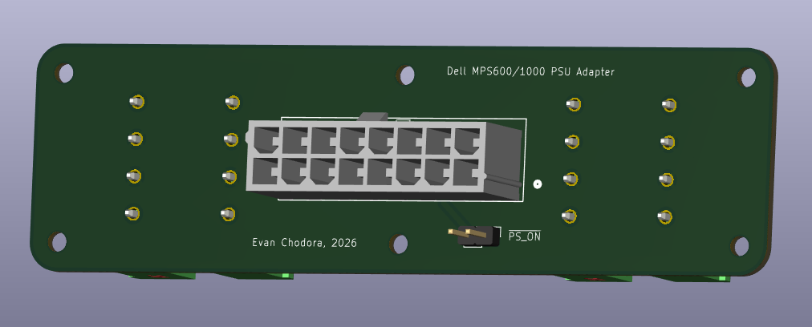
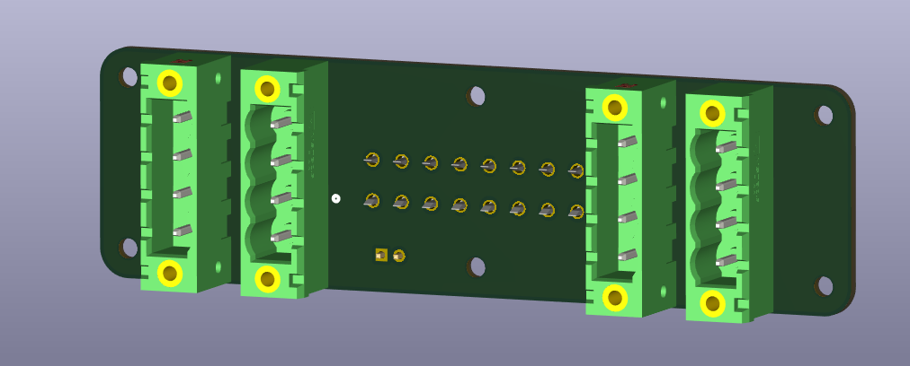

# Dell MPS1000 Power Supply Adapter

PCB design for a custom PCB to allow for repurposing the Dell MPS600 & MPS1000 power supplies for powering 48VDC rackmount equipment with screw terminal outputs.

See my website ([garageprotocols.com](https://garageprotocols.com/projects/electronics/48v_rack_power/) for more details.

